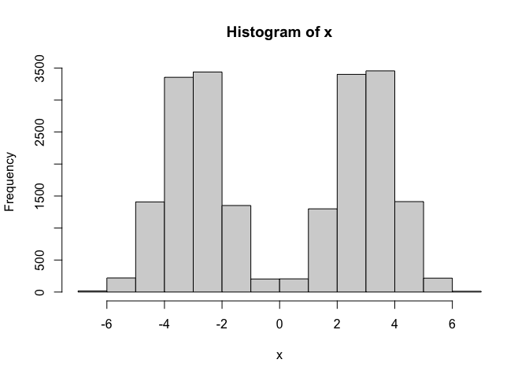
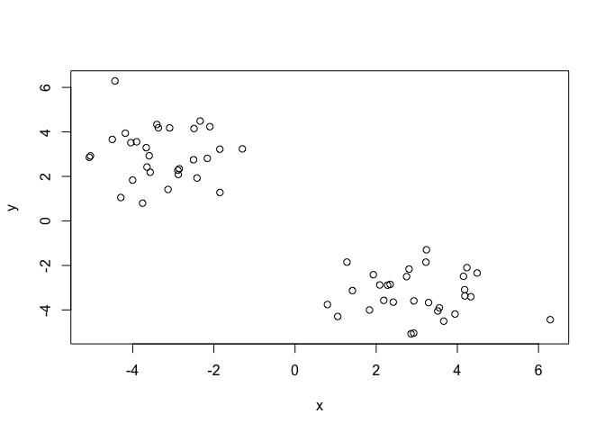
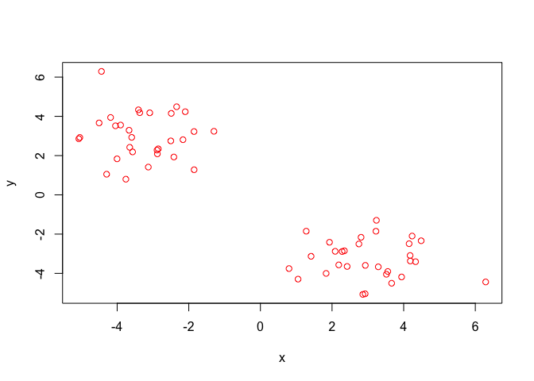
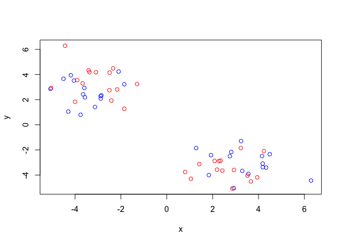
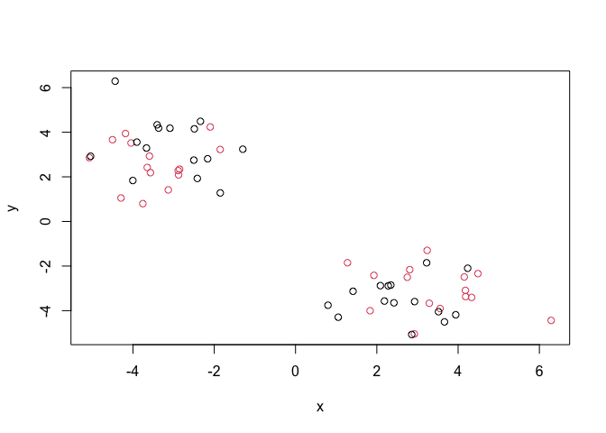
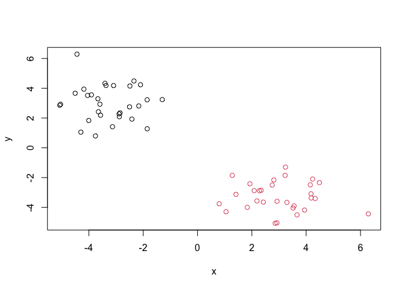
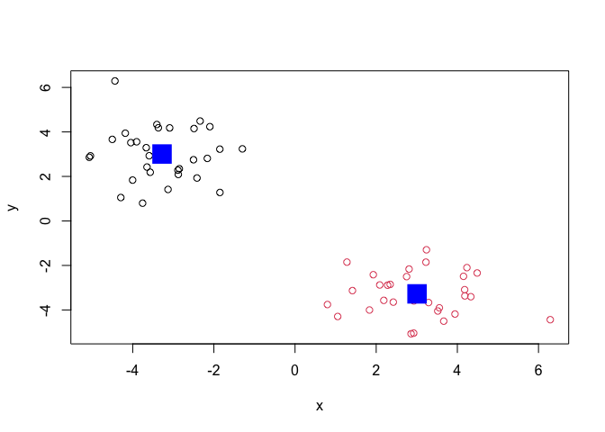
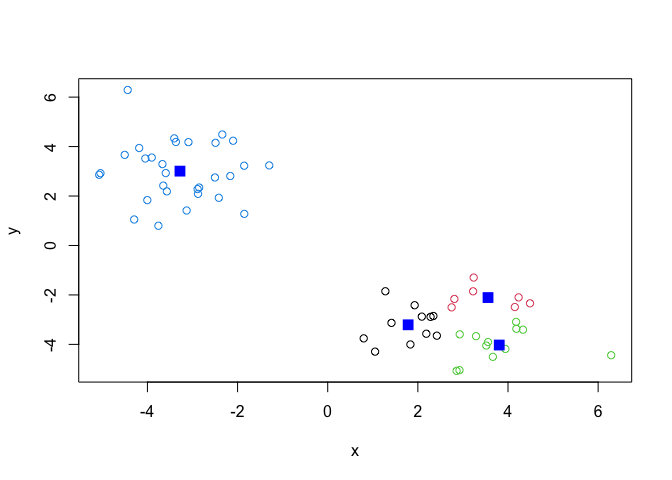
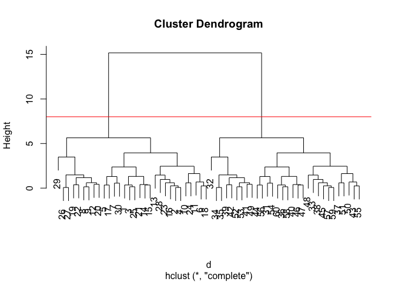

# Class 7: Machine Learning
Mehek (PID: A16868697)

Today we are going to learn how to apply different machine learning
methods, beginning with clustering:

The goals here is to find groups/clusters in your input data.

First I will make up some data with clear groups. For this I will use
the `rnorm()` function:

``` r
rnorm(10)
```

     [1]  0.05644351  1.28217137 -0.14820691 -1.03443219 -0.34455568 -0.96593375
     [7]  0.76437085 -0.52266356  1.47414295 -0.03984054

``` r
hist(rnorm(10000, mean=3))
```


``` r
n <-10000
x <- c(rnorm(n,-3), rnorm(n,+3))
hist(x)       
```



``` r
n <-30
x <- c(rnorm(n,-3), rnorm(n,+3))
y <- rev(x)

z<- cbind(x,y)
head(z)
```

                 x        y
    [1,] -3.089920 4.179771
    [2,] -2.852196 2.344286
    [3,] -3.368513 4.185353
    [4,] -2.886720 2.281792
    [5,] -2.162287 2.809952
    [6,] -3.568905 2.187488

``` r
plot(z)
```



Use the `kmeans()` function setting k to 2 and nstart=20

Inspect/print the results

> Q. How many points are in each cluster?

> Q. What ‘component’ of your result object details -cluster size?
> -cluster assignment/member -cluster center? Q. Plot x colored by the k
> means closter assignment and add cluster centers as blue points

``` r
km <- kmeans(z, centers=2)
km
```

    K-means clustering with 2 clusters of sizes 30, 30

    Cluster means:
              x         y
    1 -3.277967  3.006645
    2  3.006645 -3.277967

    Clustering vector:
     [1] 1 1 1 1 1 1 1 1 1 1 1 1 1 1 1 1 1 1 1 1 1 1 1 1 1 1 1 1 1 1 2 2 2 2 2 2 2 2
    [39] 2 2 2 2 2 2 2 2 2 2 2 2 2 2 2 2 2 2 2 2 2 2

    Within cluster sum of squares by cluster:
    [1] 69.36875 69.36875
     (between_SS / total_SS =  89.5 %)

    Available components:

    [1] "cluster"      "centers"      "totss"        "withinss"     "tot.withinss"
    [6] "betweenss"    "size"         "iter"         "ifault"      

Results in kmeans object `km`

``` r
attributes(km)
```

    $names
    [1] "cluster"      "centers"      "totss"        "withinss"     "tot.withinss"
    [6] "betweenss"    "size"         "iter"         "ifault"      

    $class
    [1] "kmeans"

cluster size?

``` r
km$size
```

    [1] 30 30

cluster assignment/membership?

``` r
km$cluster
```

     [1] 1 1 1 1 1 1 1 1 1 1 1 1 1 1 1 1 1 1 1 1 1 1 1 1 1 1 1 1 1 1 2 2 2 2 2 2 2 2
    [39] 2 2 2 2 2 2 2 2 2 2 2 2 2 2 2 2 2 2 2 2 2 2

cluster center?

``` r
km$centers
```

              x         y
    1 -3.277967  3.006645
    2  3.006645 -3.277967

> Q. Plot x colored by the k means closter assignment and add cluster
> centers as blue points

``` r
plot(z, col="red")
```



R will re-cycle the shorter color vector to be the same length as the
longer (number of data points) in z

``` r
plot(z, col=c("red", "blue"))
```



``` r
plot(z, col=c(1,2))
```



``` r
plot(z, col=km$cluster)
```



We can use the `points()` function to add new points to an existing
plot…like the cluster centers.

``` r
plot(z, col=km$cluster)
points(km$centers, col="blue", pch=15, cex=3)
```



> Q. Can you run kmeans and ask for 4 clusters please and plot the
> results like we have done above?

``` r
km1 <- kmeans(z, centers=4)
km1
```

    K-means clustering with 4 clusters of sizes 11, 7, 12, 30

    Cluster means:
              x         y
    1  1.784484 -3.207643
    2  3.557068 -2.106050
    3  3.805879 -4.026049
    4 -3.277967  3.006645

    Clustering vector:
     [1] 4 4 4 4 4 4 4 4 4 4 4 4 4 4 4 4 4 4 4 4 4 4 4 4 4 4 4 4 4 4 2 3 1 3 3 3 1 1
    [39] 3 2 3 3 1 2 1 2 2 1 3 1 1 3 3 2 1 2 1 3 1 3

    Within cluster sum of squares by cluster:
    [1]  8.393305  4.182449 14.192854 69.368755
     (between_SS / total_SS =  92.7 %)

    Available components:

    [1] "cluster"      "centers"      "totss"        "withinss"     "tot.withinss"
    [6] "betweenss"    "size"         "iter"         "ifault"      

``` r
plot(z, col=km1$cluster)
points(km1$centers, col="blue", pch=15, cex=1.5)
```



\##Hierarchal Clustering

Let’s take our same made-up data `z` and see how hierarchal clustering
works.

First we need a distance matrix of our data to be clustered.

``` r
d<- dist(z)
hc<- hclust(d)
hc
```


    Call:
    hclust(d = d)

    Cluster method   : complete 
    Distance         : euclidean 
    Number of objects: 60 

``` r
plot(hc)
abline(h=8, col="red")
```



I can get my cluster membership vector by “cutting the tree” with the
`cutree()` function like so:

``` r
grps<- cutree(hc, h=8)
grps
```

     [1] 1 1 1 1 1 1 1 1 1 1 1 1 1 1 1 1 1 1 1 1 1 1 1 1 1 1 1 1 1 1 2 2 2 2 2 2 2 2
    [39] 2 2 2 2 2 2 2 2 2 2 2 2 2 2 2 2 2 2 2 2 2 2

Can you plot `z` colored by our hclust results:

``` r
plot(z, col=grps)
```


## PCA of UK food data

Read data from the UK on food consumption in different parts of the UK

``` r
url <- "https://tinyurl.com/UK-foods"
x <- read.csv(url,row.names=1)
head(x)
```

                   England Wales Scotland N.Ireland
    Cheese             105   103      103        66
    Carcass_meat       245   227      242       267
    Other_meat         685   803      750       586
    Fish               147   160      122        93
    Fats_and_oils      193   235      184       209
    Sugars             156   175      147       139

``` r
barplot(as.matrix(x), beside=T, col=rainbow(nrow(x)))
```


``` r
barplot(as.matrix(x), beside=F, col=rainbow(nrow(x)))
```


A so-called “Pairs” plot can be useful for small datasets like this one

``` r
pairs(x, col=rainbow(10), pch=16)
```


It is hard to see structure and trends in even this small data-set. How
will we ever do this when we have big datasets with 1,000s or 10s of
thousands of this we are measuring…

### PCA to the rescue

Let’s see how PCA deals with this dataset. So main function in base R to
do PCA is called `prcomp()`

``` r
pca<- prcomp( t(x))
summary(pca)
```

    Importance of components:
                                PC1      PC2      PC3       PC4
    Standard deviation     324.1502 212.7478 73.87622 2.921e-14
    Proportion of Variance   0.6744   0.2905  0.03503 0.000e+00
    Cumulative Proportion    0.6744   0.9650  1.00000 1.000e+00

Let’s see what is inside this `pca` object that we created from running
`prcomp()`

``` r
attributes(pca)
```

    $names
    [1] "sdev"     "rotation" "center"   "scale"    "x"       

    $class
    [1] "prcomp"

``` r
pca$x
```

                     PC1         PC2        PC3           PC4
    England   -144.99315   -2.532999 105.768945 -9.152022e-15
    Wales     -240.52915 -224.646925 -56.475555  5.560040e-13
    Scotland   -91.86934  286.081786 -44.415495 -6.638419e-13
    N.Ireland  477.39164  -58.901862  -4.877895  1.329771e-13

``` r
plot(pca$x[,1], pca$x[,2], 
     col=c("black", "red", "blue", "darkgreen"), pch=16,
     xlab="PC1 (67.4%)", ylab="PC2 (29%)")
```


``` r
par(mar=c(10, 3, 0.35, 0))
barplot( pca$rotation[,1], las=2 )
```


